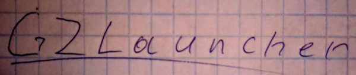

# 🔥🔥🔥GZLauncher🔥🔥🔥

Simple launcher for GZDoom written in Python.

**WARNING!** This repo does not contains any game file, this is only launcher!

## ✅ Features
1. Manage games or mods throught simple configuration file!
2. Full in-game log stored in file!
3. No stupid ".dot" directories! Put game files to any path you want!
4. Different saves path for games. Now your saves will not be lost!
5. You can create single game distribution for Windows or Linux!


## 🚀 Getting Started

1. Download the release
2. Put ```gzlauncher.pyz``` in any directory you want
3. Run the launcher by command ```./gzlauncher.pyz```
4. Edit config. By default config will be created in the same directory

## 🛠 Technical info
##### This section contains boring words, skip if not interested.
**TODO:**
"So, python is a realy great tool for creating launchers! Python's standart library is realy amazing, but there are some nuances for end users. First of all python is an interpreted language, it requires [runtime](https://www.python.org/downloads/). You absolutely can't use this cool launcher without python installation. Next, python's programs usually consist of some ".py" files. I prefer compress all of these files in one ".pyz" archive. ..."

---
## ❓ FAQ
- **Q**: Are you doomer?
- **A**: No
- **Q**: Why python?
- **A**: Beacuse python is a snake, wow🐍
- **Q**: Why you create this AMAZING launcher? GZDoom runs games great and without any troubles!
- **A**: Yes, but gzdoom is not so easy! You should put game files in special directory, should create run script with command line arguments, should configure this fu*cking config etc. This launcher is almost the same, but more convenient.
---
## 📝 Versioning

I use [SemVer](http://semver.org/) for versioning.

## 👽 Authors

* [**Igorek536**](https://github.com/Igorek536) - *Initial work*

## 📜 License

This project is licensed under the GPL3 License - see the [LICENSE.md](LICENSE.md) file for details

📰 Good news!
===
## 🎉 0.1.0
**Release date:** 28.04.2019
- First release
